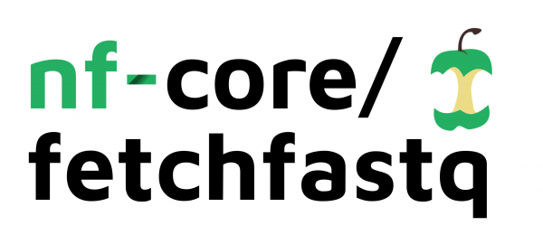

# 

[](https://github.com/nf-core/fetchfastq/actions?query=workflow%3A%22nf-core+CI%22)
[](https://github.com/nf-core/fetchfastq/actions?query=workflow%3A%22nf-core+linting%22)
[](https://nf-co.re/fetchfastq/results)
[](https://doi.org/10.5281/zenodo.XXXXXXX)

[](https://www.nextflow.io/)
[](https://docs.conda.io/en/latest/)
[](https://www.docker.com/)
[](https://sylabs.io/docs/)

[](https://nfcore.slack.com/channels/fetchfastq)
[](https://twitter.com/nf_core)
[](https://www.youtube.com/c/nf-core)

## Introduction

**nf-core/fetchfastq** is a bioinformatics pipeline to fetch metadata and raw FastQ files from public databases. At present, the pipeline supports SRA / ENA / GEO ids (see [usage docs](https://nf-co.re/fetchfastq/usage#introduction)).

The pipeline is built using [Nextflow](https://www.nextflow.io), a workflow tool to run tasks across multiple compute infrastructures in a very portable manner. It uses Docker/Singularity containers making installation trivial and results highly reproducible. The [Nextflow DSL2](https://www.nextflow.io/docs/latest/dsl2.html) implementation of this pipeline uses one container per process which makes it much easier to maintain and update software dependencies.

On release, automated continuous integration tests run the pipeline on a full-sized dataset on the AWS cloud infrastructure. This ensures that the pipeline runs on AWS, has sensible resource allocation defaults set to run on real-world datasets, and permits the persistent storage of results to benchmark between pipeline releases and other analysis sources. The results obtained from the full-sized test can be viewed on the [nf-core website](https://nf-co.re/fetchfastq/results).

## Pipeline summary

Via a single file of ids, provided one-per-line the pipeline performs the following steps:

1. Resolve database ids back to appropriate experiment-level ids and to be compatible with the [ENA API](https://ena-docs.readthedocs.io/en/latest/retrieval/programmatic-access.html)
2. Fetch extensive id metadata including direct download links to FastQ files via ENA API
3. Download FastQ files in parallel via `curl` and perform `md5sum` check
4. Collate id metadata and paths to FastQ files in a single samplesheet

The columns in the auto-created samplesheet can be tailored to be accepted out-of-the-box by selected nf-core pipelines, these currently include [nf-core/rnaseq](https://nf-co.re/rnaseq/usage#samplesheet-input) and [nf-core/viralrecon](https://nf-co.re/viralrecon/usage#illumina-samplesheet-format). You can use the `--nf_core_pipeline` parameter to customise this behaviour e.g. `--nf_core_pipeline rnaseq`. More pipelines will be supported in due course as we adopt and standardise samplesheet input across nf-core.

## Quick Start

1. Install [`Nextflow`](https://nf-co.re/usage/installation) (`>=21.04.0`)

2. Install any of [`Docker`](https://docs.docker.com/engine/installation/), [`Singularity`](https://www.sylabs.io/guides/3.0/user-guide/), [`Podman`](https://podman.io/), [`Shifter`](https://nersc.gitlab.io/development/shifter/how-to-use/) or [`Charliecloud`](https://hpc.github.io/charliecloud/) for full pipeline reproducibility _(please only use [`Conda`](https://conda.io/miniconda.html) as a last resort; see [docs](https://nf-co.re/usage/configuration#basic-configuration-profiles))_

3. Download the pipeline and test it on a minimal dataset with a single command:

    ```console
    nextflow run nf-core/fetchfastq -profile test,<docker/singularity/podman/shifter/charliecloud/conda/institute>
    ```

    > * Please check [nf-core/configs](https://github.com/nf-core/configs#documentation) to see if a custom config file to run nf-core pipelines already exists for your Institute. If so, you can simply use `-profile <institute>` in your command. This will enable either `docker` or `singularity` and set the appropriate execution settings for your local compute environment.
    > * If you are using `singularity` then the pipeline will auto-detect this and attempt to download the Singularity images directly as opposed to performing a conversion from Docker images. If you are persistently observing issues downloading Singularity images directly due to timeout or network issues then please use the `--singularity_pull_docker_container` parameter to pull and convert the Docker image instead. Alternatively, it is highly recommended to use the [`nf-core download`](https://nf-co.re/tools/#downloading-pipelines-for-offline-use) command to pre-download all of the required containers before running the pipeline and to set the [`NXF_SINGULARITY_CACHEDIR` or `singularity.cacheDir`](https://www.nextflow.io/docs/latest/singularity.html?#singularity-docker-hub) Nextflow options to be able to store and re-use the images from a central location for future pipeline runs.
    > * If you are using `conda`, it is highly recommended to use the [`NXF_CONDA_CACHEDIR` or `conda.cacheDir`](https://www.nextflow.io/docs/latest/conda.html) settings to store the environments in a central location for future pipeline runs.

4. Start running your own analysis!

    ```console
    nextflow run nf-core/fetchfastq -profile <docker/singularity/podman/shifter/charliecloud/conda/institute> --input ids.txt
    ```

## Documentation

The nf-core/fetchfastq pipeline comes with documentation about the pipeline [usage](https://nf-co.re/fetchfastq/usage), [parameters](https://nf-co.re/fetchfastq/parameters) and [output](https://nf-co.re/fetchfastq/output).

## Credits

nf-core/fetchfastq was originally written by Harshil Patel ([@drpatelh](https://github.com/drpatelh)) from [The Bioinformatics & Biostatistics Group](https://www.crick.ac.uk/research/science-technology-platforms/bioinformatics-and-biostatistics/) at [The Francis Crick Institute, London](https://www.crick.ac.uk/) and Jose Espinosa-Carrasco ([@JoseEspinosa](https://github.com/JoseEspinosa)) from [The Comparative Bioinformatics Group](https://www.crg.eu/en/cedric_notredame) at [The Centre for Genomic Regulation, Spain](https://www.crg.eu/).

## Contributions and Support

If you would like to contribute to this pipeline, please see the [contributing guidelines](.github/CONTRIBUTING.md).

For further information or help, don't hesitate to get in touch on the [Slack `#fetchfastq` channel](https://nfcore.slack.com/channels/fetchfastq) (you can join with [this invite](https://nf-co.re/join/slack)).

## Citations

<!-- TODO nf-core: Add citation for pipeline after first release. Uncomment lines below and update Zenodo doi and badge at the top of this file. -->
<!-- If you use  nf-core/fetchfastq for your analysis, please cite it using the following doi: [10.5281/zenodo.XXXXXX](https://doi.org/10.5281/zenodo.XXXXXX) -->

An extensive list of references for the tools used by the pipeline can be found in the [`CITATIONS.md`](CITATIONS.md) file.

You can cite the `nf-core` publication as follows:

> **The nf-core framework for community-curated bioinformatics pipelines.**
>
> Philip Ewels, Alexander Peltzer, Sven Fillinger, Harshil Patel, Johannes Alneberg, Andreas Wilm, Maxime Ulysse Garcia, Paolo Di Tommaso & Sven Nahnsen.
>
> _Nat Biotechnol._ 2020 Feb 13. doi: [10.1038/s41587-020-0439-x](https://dx.doi.org/10.1038/s41587-020-0439-x).
